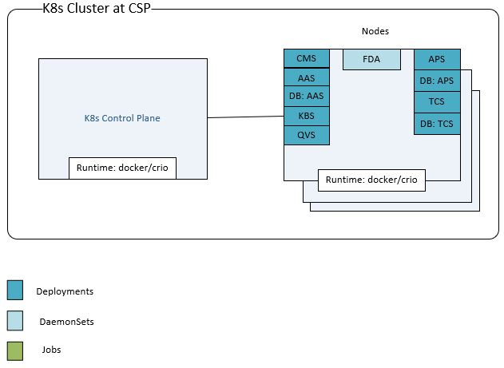

# Helm Chart Deployment steps for TEE Attestation Usecase

A collection of helm charts for TEE Attestation Usecase

<!-- @import "[TOC]" {cmd="toc" depthFrom=1 depthTo=6 orderedList=false} -->

<!-- code_chunk_output -->

  - [Getting Started](#getting-started)
    - [Pre-requisites](#pre-requisites)
    - [Support Details](#support-details)
    - [Use Case Helm Charts](#use-case-helm-charts)
    - [Setting up for Helm deployment](#setting-up-for-helm-deployment)
        - [Create Secrets for Database of Services](#create-secrets-for-database-of-services)
    - [Installing isecl-helm charts](#installing-isecl-helm-charts)
      - [Update `values.yaml` for Use Case chart deployments](#update-valuesyaml-for-use-case-chart-deployments)
      - [Use Case charts Deployment](#usecase-based-chart-deployment-using-umbrella-charts)
      - [Individual Service/Agent Charts Deployment](#individual-helm-chart-deployment-using-servicejob-charts)
      - [Setup task workflow](#setup-task-workflow)

<!-- /code_chunk_output -->

# Deployment diagram


## Getting Started
Below steps guide in the process for installing isecl-helm charts on a kubernetes cluster.

### Pre-requisites
* Non Managed Kubernetes Cluster up and running
* Helm 3 installed
  ```shell
  curl -fsSL -o get_helm.sh https://raw.githubusercontent.com/helm/helm/master/scripts/get-helm-3
  chmod 700 get_helm.sh
  ./get_helm.sh
  ```

* For building container images Refer here for [instructions](https://github.com/intel-secl/docs/blob/v4.2/develop/docs/quick-start-guides/Foundational%20%26%20Workload%20Security%20-%20Containerization/5Build.md)  

* Setup NFS, Refer [instructions](../../docs/NFS-Setup.md) for setting up and configuring NFS Server

### Support Details

| Kubernetes        | Details                                                      |
| ----------------- | ------------------------------------------------------------ |
| Cluster OS        | *RedHat Enterprise Linux 8.x* <br/>*Ubuntu 20.04*            |
| Distributions     | Any non-managed K8s cluster                                  |
| Versions          | v1.23                                                        |
| Storage           | NFS                                                          |
| Container Runtime | *docker*,*CRI-O*<br/>                                        |

### Use Case Helm Charts 

| Use case                                | Helm Charts                                                 |
| --------------------------------------- | ----------------------------------------------------------- |
| Tee Attestation                         | *cms*<br />*aas*<br />*kbs*<br />*qvs*<br />*aps*<br />*tcs*<br />*fda*<br />|


### Setting up for Helm deployment

##### Create Secrets for KBS KMIP Certificates
Copy KMIP Client Certificate, Client Key and Root Certificate from KMIP Server to Node where KMIP secrets needs to be generated.

```shell script
kubectl create secret generic kbs-kmip-certs -n isecl --from-file=client_certificate.pem=<KMIP Client Certificate Path> --from-file=client_key.pem=<KMIP Client Key Path> --from-file=root_certificate.pem=<KMIP Root Certificate Path>
``` 

#### Installing isecl-helm charts

* Add the chart repository
```shell script
helm repo add isecl-helm https://intel-secl.github.io/helm-charts
helm repo update
```

* To find list of available charts
```shell script
helm search repo --versions
``` 

### Usecase based chart deployment (using umbrella charts)

#### Update `values.yaml` for Use Case chart deployments

Some assumptions before updating the `values.yaml` are as follows:
* The images are built on the build machine and images are pushed to a registry tagged with `release_version`(e.g:v5.0.0) as version for each image
* The NFS server setup is done either using sample script [instructions](../../docs/NFS-Setup.md) or by the user itself
* The K8s non-managed cluster is up and running
* Helm 3 is installed

The helm chart support Nodeports for services to support ingress model, enable the ingress by setting the value ingress enabled to true in values.yaml file.

Update the ```cmsUrl and aasUrl``` under global section according to the configured model.
e.g For ingress. cmsUrl: https://cms.isecl.com/cms/v1
    For Nodeport, cmsUrl: https://<controlplane-hostname/IP>:30445/cms/v1

#### Use Case charts Deployment

```shell script
export VERSION=v5.0.0
helm pull isecl-helm/TEE-Attestation --version $VERSION && tar -xzf TEE-Attestation-$VERSION.tgz TEE-Attestation/values.yaml
helm install <helm release name> isecl-helm/TEE-Attestation --version $VERSION -f TEE-Attestation/values.yaml --create-namespace -n <namespace>
```

#### Follow the build instructions for SKC Library and update the isecl-skc-k8s.env and install SKC Library using below command(Only for SGX attestation use-case)

```shell script
./skc-bootstrap.sh install
```

> **Note:** If using a separate .kubeconfig file, ensure to provide the path using `--kubeconfig <.kubeconfig path>`

## Setup task workflow.
* Refer [instructions](../../docs/setup-task-workflow.md) for running service specific setup tasks

To uninstall a chart
```shell script
helm uninstall <release-name> -n <namespace>
```

To list all the helm chart deployments 
```shell script
helm list -A
```

Cleanup steps that needs to be done for a fresh deployment
* Uninstall all the chart deployments.
* Cleanup the data at NFS mount and FDA data mount on each nodes(/etc/fda and /var/log/fda).
* Remove all objects(secrets, rbac, clusterrole, service account) related namespace related to deployment ```kubectl delete ns <namespace>```. 

**Note**: 
    
    Before redeploying any of the chart please check the pv and pvc of corresponding deployments are removed. Suppose
    if you want to redeploy aas, make sure that aas-logs-pv, aas-logs-pvc, aas-config-pv, aas-config-pvc, aas-db-pv, aas-db-pvc, aas-base-pvc are removed successfully.
    Command: ```kubectl get pvc -n <namespace>``` && ```kubectl get pv -n <namespace>``` 
